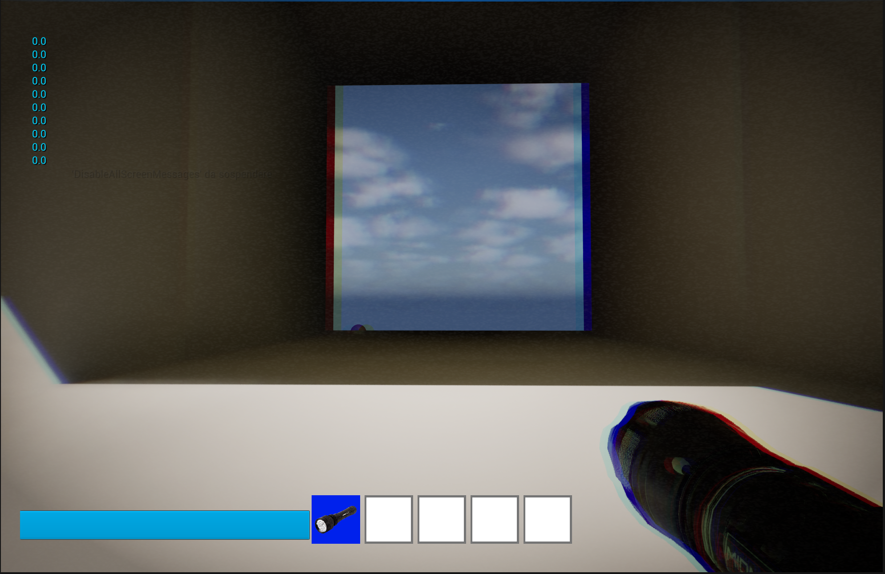
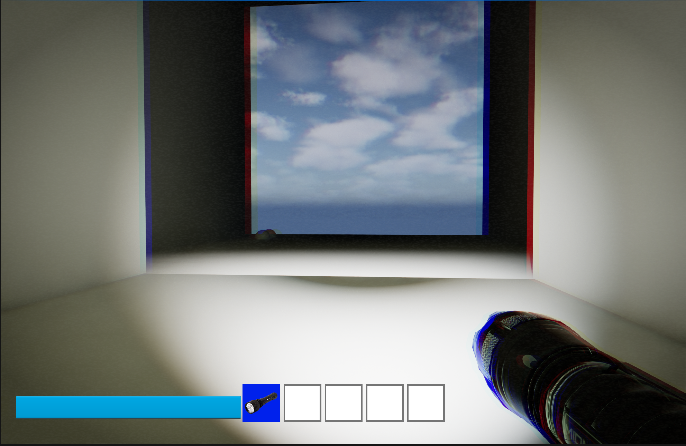

# Portfolio
# Game Developer – Unreal Engine (Hobby)

Hi!  
I’m a hobby game developer focused on **gameplay systems and prototyping**.  
I’m looking for people interested in collaborating on a small **non-commercial / hobby project**, with the goal of learning and building a solid portfolio piece together and possibly a good game.

## 🎮 Projects
## Current state of the Unreal Project
### Working Inventory system with drop and pick up, also stamina system with sprint

### Stress changes visual effects and is relative to the room

### torch activated nullifies the room light level so that stress will lower

### Room spawn system based on stress levels, in this case stress level is high so a random room appears after the story room

### when stress goes back to normal story related rooms start spawning again

## Other Projects

### Balatro (Python – mechanics study)
A simplified recreation of *Balatro* to study game systems and logic.  
🔗 https://github.com/ethandelb/Balatro_python

### Tic Tac Toe
Small project focused on programming logic and structure.  
🔗 https://github.com/OC-LIBE/progetto-4-tic-tac-toe-ethandelb

## 🎨 Blender (Beginner)
I have some experience in Blender, however it's been a long time since i have used it. If you want screenshots I have to find my old pc but if you are interested don't mind asking.

## 🛠 Tools
- Unreal Engine 5
- Blender
- Python, javascript, css, html
- Git / GitHub

📬 Contact: Reddit DM / Discord: isanpt

