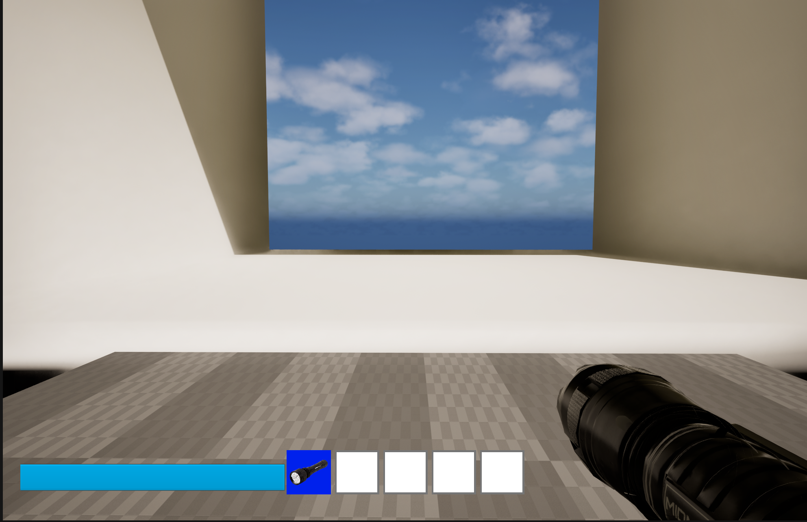

# Portfolio
# Game Developer – Unreal Engine (Hobby)

Hi!  
I’m a hobby game developer focused on **gameplay systems and prototyping**.  
I’m looking for people interested in collaborating on a small **non-commercial / hobby project**, with the goal of learning and building a solid portfolio piece together and possibly a good game.

## 🎮 Projects
### Working Inventory system with drop and pick up, also stamina system with sprint

![image] (/workspaces/Portfolio/images/UE5 project/Screenshot 2026-01-27 211341.png)
torch activated nullifies the room light level so that stress will lower
Immagine
Room spawn system based on stress levels, in this case stress level is high so a random room appears after the story room
Immagine
when stress goes back to normal story related rooms start spawning again
Immagine

### Balatro (Python – mechanics study)
A simplified recreation of *Balatro* to study game systems and logic.  
🔗 https://github.com/ethandelb/Balatro_python

### Tic Tac Toe
Small project focused on programming logic and structure.  
🔗 https://github.com/OC-LIBE/progetto-4-tic-tac-toe-ethandelb

## 🎨 Blender (Beginner)
I’m currently learning Blender to create simple assets for prototyping.
A few study screenshots / exercises:
👉 link to Imgur album or folder

## 🛠 Tools
- Unreal Engine 5
- Blender
- Python
- Git / GitHub

📬 Contact: Reddit DM / Discord

